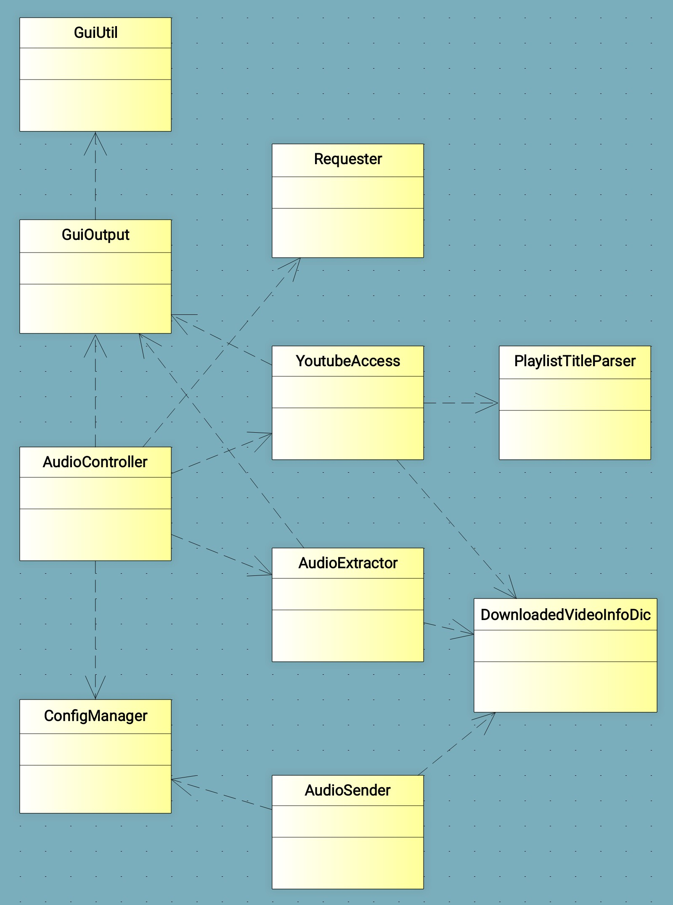

# youtube_audio_downloader

## Status
In development. Clip audio function working.

## Purpose
This Python utility automates the download and extraction of the audio track of 
Youtube videos. It is used mainly on conferences or interviews to select the 
most significant audio parts or remove musical or uninteresting audio portions.

It is possible to specify which audio parts must be extracted or/and which
portions must be suppressed.

Then, the extracted audio files can be shared by email or through WhatsApp.

## How it works
For the videos to be downloaded and converted to audio, they must be added to
a Youtube playlist. **The playlist must be set to public access**. If the audio
is to be splitted into parts (the interesting portions of the video audio
track), a list of time frames must be added to the playlist title. Below are
some examples of playlist titles. Before launching the utility, the playlist
url must be copied into the clipboard, from which it will be automatically 
obtained by the utility.

### Playlist title examples
My playlist title  
*For each video contained in the playlist, its audio track will be downloaded
integrally, with no extraction/suppression.*

My two video playlist title (**e**0:0:20-0:02:45)  
*Here, for the first video, the audio portion starting at 20 seconds and ending
at 2 minutes 45 seconds will be extracted (meaning of the **e** - **extract** letter). The audio
of the second video will be kept unmodified.*

My two video multiple extract playlist title (**e**0:0:20-0:02:45 **e**1:22:45-1:25:0) (**e**0:0:0-0:05:45 **e**0:22:45-**e**)  
*Here, for the first video, two audio parts will be extracted. Same thing for
the second video, with the second portion starting at 22 minutes 45 seconds and going
to the end of the audio track (letter **e** means **end** here).*

My one video suppress playlist title (**s**0:0:0-0:02:45 **s**0:22:45-**e**)  
*Here, the audio portions from beginning to 2 minutes 45 seconds and from
22 minutes 44 seconds to the end will be suppressed (meaning of the
**s** - **suppress** letter). Only one audio file will remain, without the 
suppressed parts.*

## Additional functionalities

### Editing an mp3 file
In case an extracted portion needs to be further trimmed, the utility
can be started with **e** option(s), like shown below:

audiodownload filePathName **e**0:0:2-**e**  
*Removes the first 3 seconds of the audio file (the second **e** 
means **end**).*

In case you are not sure how many seconds must be trimmed, you can 
specify several extract options: 

audiodownload filePathName **e**0:0:2-**e** **e**0:0:3-**e**  
*Removes the first 2 and 3 seconds of the audio file, creating two 
trimmed audio files with respectively the first 2 or 3 seconds 
trimmed.*

audiodownload filePathName **e**0:0:2-0:10:55 **e**0:0:3-0:10:53  
*Removes the first seconds of the audio file like in the previous 
example, creating two trimmed audio files. But now the resulting
files are ending at different positions.*

Note that any number of extract options can be specified !

### Downloading the audio of a single video
This is done automatically if the url obtained from the clipboard points to a
video and not to a playlist. In this case, the video audio track is 
downloaded to a directory specified in the app settings.

## Project class diagram

  

## Required libraries
- configobj
- pytube 11.0.1
- youtube_dl
- moviepy (not working on Android !. Version 2.0.0.dev2. Version 1.0.2 and 1.0.3 not working !)
- mutagen
- kivy
- pydub
- soundfile
- pyrubberband
- pyautogui
- ffpyplayer 4.3.2
- decorator 4.4.2 (updated version 5 ... causes audio extraction problems)